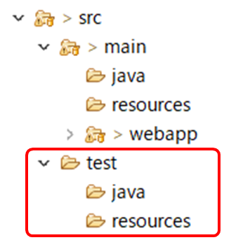
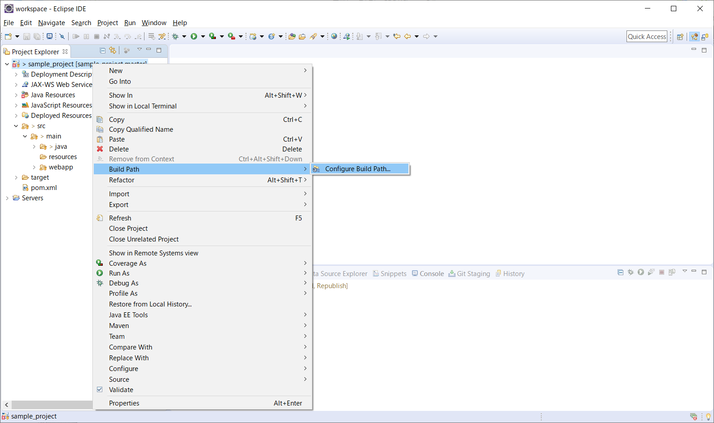
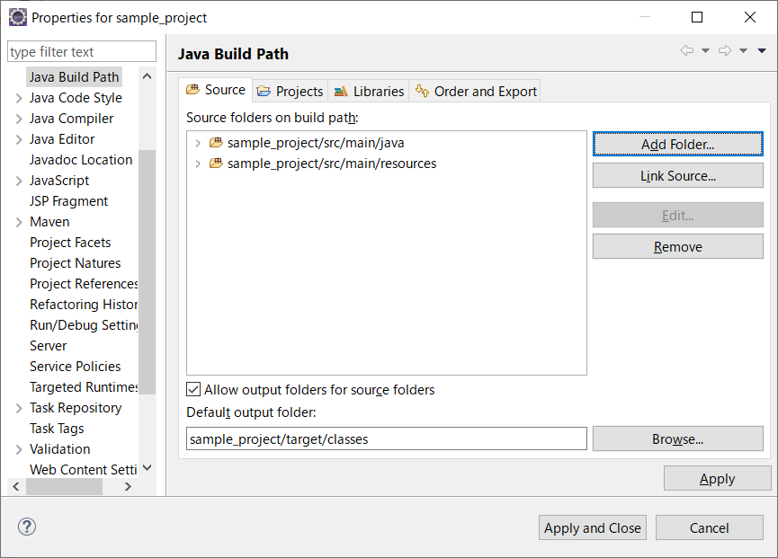
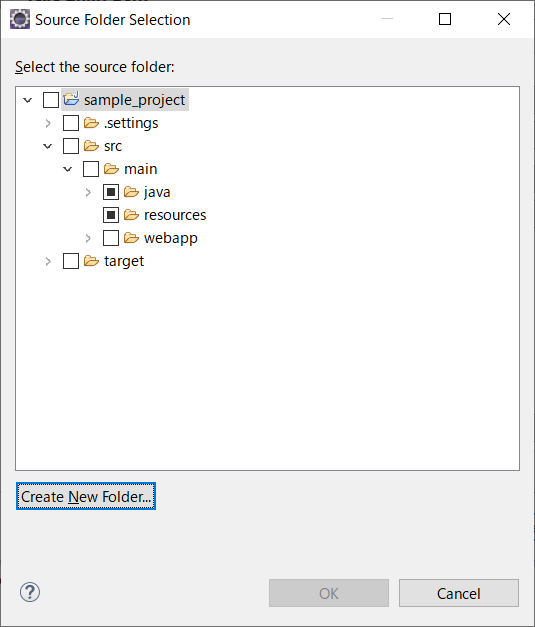
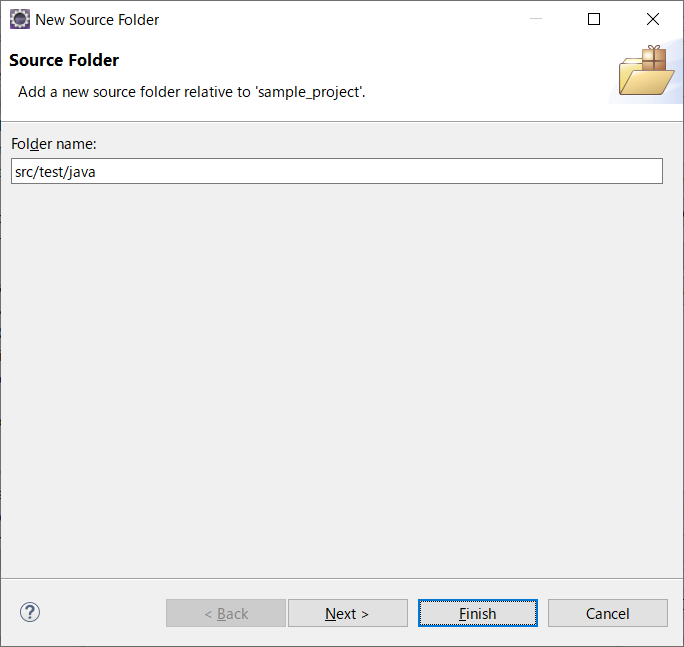
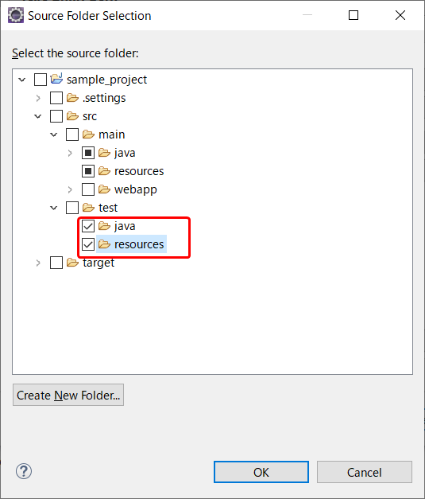
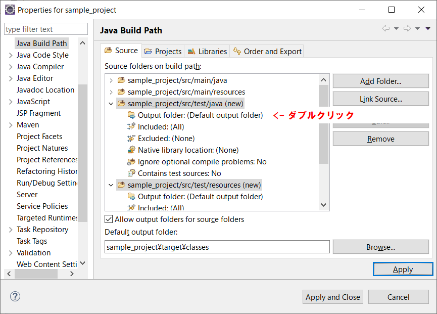
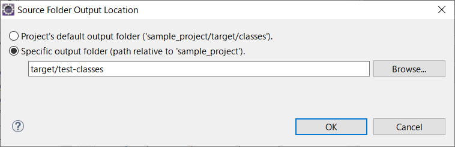
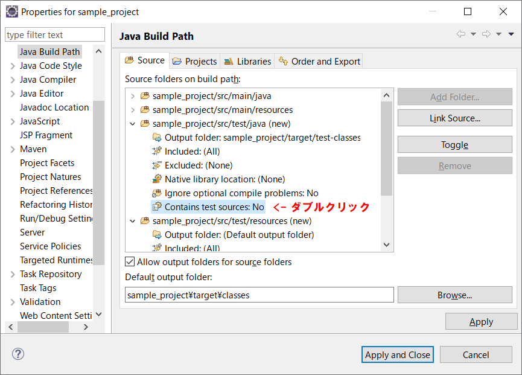
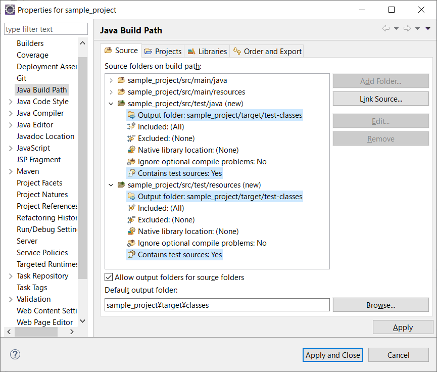

# 自動テストツール

## 1. Mavenプロジェクトでの自動テスト

Mavenプロジェクトではテストコードは ***src/test/java*** のフォルダの中に作成します。***src/test/java*** と ***src/test/resources*** はMavenプロジェクトを作成するとデフォルトで用意されますが、Git経由でプロジェクトを取り込んだ場合、フォルダが消失している可能性があります。

そうした場合は、Configure Build Path（ビルドパスの構成）からテスト用のフォルダを作成してください。

### 1-1. testフォルダの作成

- プロジェクトを右クリック > Build Path > Configure Build Path

 

- ***src/test/java*** と ***src/test/resources*** がないことを確認し、[Add Folder]ボタンをクリックする

 

- プロジェクト名を選択状態で、[Create New Folder]ボタンをクリックする

 

- Folder name欄に「**src/test/java**」と入力する
- [Finish]ボタンをクリックする

> 同様の手順で、***src/test/resources*** も作成します。

 

- 上画像のような構成になっていることを確認する

 

- src/test/java の ***Output folder*** をダブルクリックする

 

- ***Specific output folder*** を選択する
- テキストボックスに「**target/test-classes**」と入力する
- [OK]ボタンをクリックする

 

- ***Contains test sources*** をダブルクリックする

> 値が ***No*** から ***Yes*** に切り替わります。

> ***src/test/resources*** に対しても同様の手順で、Output folderとContains test sourcesを設定してください。

 

- 上画像のような構成になっていることを確認する

 

<a href="02-junit.md">>> 02. JUnitの実践</a>

<a href="../README.md">>> メニューへ</a>
