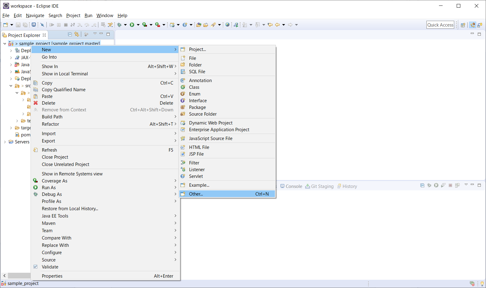
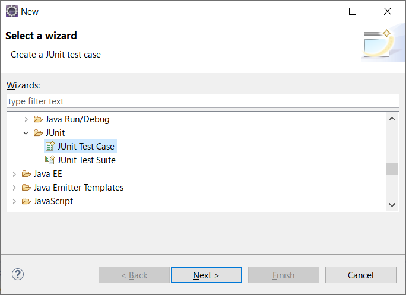
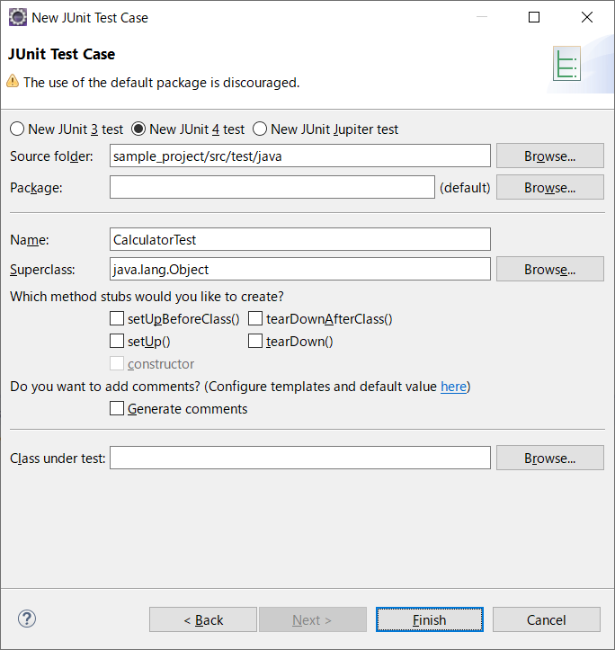
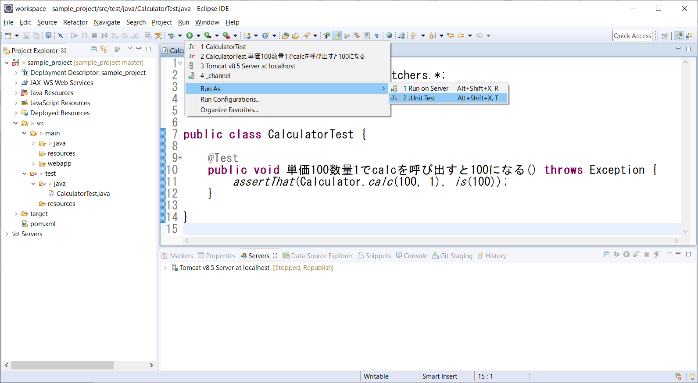
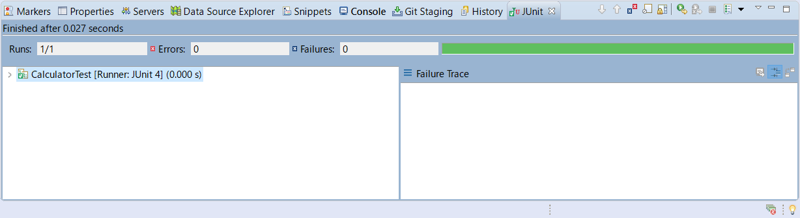
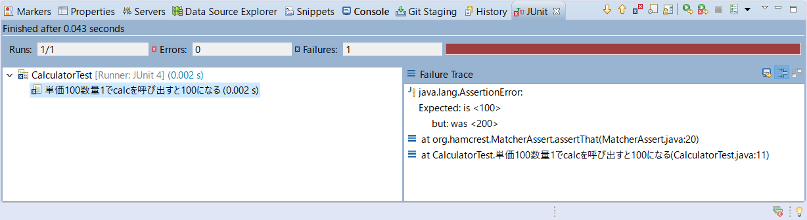

# 自動テストツール

## 2. JUnit

それでは、JUnitを使ったテストコードを作成しましょう。<br>まずはテスト対象のコードを作成します。演習用に**Calculator**クラスを作成し、以下のように編集します。

```java
package jp.sample;
import java.math.BigDecimal;

public class Calculator {
    public static int calc(int price, int count) throws Exception {
        if (count >= 1) {
            return price * count;
        }
        throw new Exception();
    }

    public static int discount(int price, int count) throws Exception {
        return new BigDecimal(calc(price, count)).multiply(
               new BigDecimal("0.9")).setScale(0, BigDecimal.ROUND_HALF_UP)
               .intValue();
    }
}
```

<br>

### 2-1. テストコードを作成する



- プロジェクトを右クリック > New > Other...

<br>



- Java > JUnit > **JUnit Test Case** を選択する
- [Next]ボタンをクリックする

<br>



- クラス名を **CalculatorTest** とする
- [Finish]ボタンをクリックする

<br>

```Java
import static org.junit.Assert.*;
import static org.hamcrest.CoreMatchers.*;
import org.junit.Test;

import jp.sample.Calculator;

public class CalculatorTest {
    @Test
    public void 単価100数量1でcalcを呼び出すと100になる() throws Exception {
        assertThat(Calculator.calc(100, 1), is(100));
    }
}
```

- CalculatorTestクラスの内容を上記のように編集する

> **assertThat ( テスト対象の値（メソッドなど） , 期待値（isなどの Mactcher を使用） )**<br>実行結果の検証には ***is*** などの ***Matcher*** を使用します。<br>is 以外にも以下のような Matcher が用意されています。

| メソッド名 | 内容 |
|:----------:|-----|
| is, equalTo | 同値である |
| not | 同値でない |
| nullValue | nullである |
| notNullValue | nullでない |
| instanceOf | 指定したクラスのインスタンスである |
| containsString | 指定した文字列が含まれる |
| isEmptyOrNullString | 空文字またはnullである |
| greaterThan | 指定した値より大きい |
| greaterThanOrEqualTo | 指定した値以上である |
| lessThan | 指定した値より小さい |
| lessThanOrEqualTo | 指定した値以下である |


<br>

### 2-2. テストを実行する



- Eclipseの実行ボタン > Run As > JUnit Test

<br>



> JUnitタブが表示され、テストの実行結果が表示されます。<br>今回の場合、calcメソッドの結果と期待値が一致するため正常終了しています（エラーは表示されません）。

<br>



> calcメソッドの結果と期待値が一致しない場合、エラーとして表示されます。

<br>

<a href="../README.md">>> メニューへ</a>
