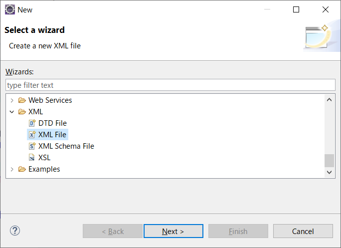

# 自動テストツール

## 3. DbUnit

テストの自動化を進める上で課題となるのがデータベースを扱うプログラムのテストです。DAO（Data Access Object）クラスのようなデータベースを扱うプログラムは、事前作業としてデータベース上のテーブルを正しくセットアップしないと期待するテスト結果を得ることができません。<br>DbUnit はデータベースを操作するプログラムのテストを支援するテストライブラリです。JUnit を拡張するライブラリとして設計されています。DbUnit を使えば、テストメソッドを実行する度にデータベースの状態をあるべき状態に設定したり、データベースを更新するプログラムの期待値を検証したりすることができます。

http://dbunit.sourceforge.net/

<br>

### 3-1. 事前準備

DbUnitを使ったテストを実施する前に、テスト対象となるコードと環境を用意しましょう。

MySQLに ***fruits_shop*** データベースを作成し、***fruits*** テーブルを作成します。

```sql
create table fruits(
    id integer primary key,
    name varchar(20),
    price integer
);
```

<br>

次に、Eclipseで ***FruitsDAO*** クラスと ***FruitsDTO*** クラスを作成します。

**Package**: jp.shop.dao<br>**Name**: FruitsDAO

```java
package jp.shop.dao;

import java.sql.Connection;
import java.sql.PreparedStatement;
import java.sql.ResultSet;
import java.sql.SQLException;
import java.sql.Statement;
import java.util.ArrayList;
import java.util.List;

import javax.servlet.ServletException;

import jp.shop.dto.FruitsDto;

public class FruitsDAO {

    protected Connection conn;

    public FruitsDAO(Connection conn) {
        this.conn = conn;
    }

    /**
     * findAllメソッド
     * @return
     */
    public List<FruitsDto> findAll() {
        try (Statement st = conn.createStatement()) {
            ResultSet rs = st.executeQuery("select * from fruits");

            List<FruitsDto> fruitsList = new ArrayList<>();
            while (rs.next()) {
                FruitsDto fruit = new FruitsDto();
                fruit.setId(rs.getInt("id"));
                fruit.setName(rs.getString("name"));
                fruit.setPrice(rs.getInt("price"));
                fruitsList.add(fruit);
            }
            return fruitsList;

        } catch (SQLException e) {
            throw new RuntimeException(e);
        }
    }

    /**
     * createメソッド
     * @param fruit
     * @throws ServletException
     */
    public void create(FruitsDto fruit) {
        try (PreparedStatement ps = conn.prepareStatement("insert into fruits values(?, ?, ?)");) {

            ps.setInt(1, fruit.getId());
            ps.setString(2, fruit.getName());
            ps.setInt(3, fruit.getPrice());

            ps.executeUpdate();

        } catch (SQLException e) {
            e.printStackTrace();
        }
    }
}
```

<br>

**Package**: jp.shop.dto<br>**Name**: FruitsDto

```java
package jp.shop.dto;

public class FruitsDto {

    private int id;
    private String name;
    private int price;

    public int getId() {
        return id;
    }
    public void setId(int id) {
        this.id = id;
    }
    public String getName() {
        return name;
    }
    public void setName(String name) {
        this.name = name;
    }
    public int getPrice() {
        return price;
    }
    public void setPrice(int price) {
        this.price = price;
    }    
}
```

<br>

### 3-2. DbUnitの実践１（findAllメソッドのテスト）

では、DbUnitを使ってFruitsDAOクラスの**findAll**メソッドのテストを実施してみましょう。<br>テストするためには、fruitsテーブルのデータを初期化する必要があります。<br>初期値として登録するデータはXMLファイルに定義することができます。

<br>



- プロジェクトで右クリック > [New] > [Other...]
- [XML] > [XML File] を選択する

<br>


- XMLファイルを作成する<br>**Folder**: src/test/resources<br>**File name**: init_fruits.xml
- 作成したXMLファイルに初期データを定義する（下記コード参照）

```xml
<dataset>
    <fruits id="1" name="Apple" price="100" />
    <fruits id="2" name="Banana" price="200" />
    <fruits id="3" name="Cherry" price="300" />
</dataset>
```

<br><br>


- JUnitテストケースを作成する<br>**Package**: jp.shop.dao<br>**Name**: FruitsDAOTest<br>
- テストコードを記述する（下記コード参照）

```java
package jp.shop.dao;

import static org.hamcrest.CoreMatchers.*;
import static org.junit.Assert.*;

import java.io.File;
import java.sql.Connection;
import java.sql.DriverManager;
import java.util.List;

import org.dbunit.Assertion;
import org.dbunit.database.DatabaseConnection;
import org.dbunit.database.IDatabaseConnection;
import org.dbunit.dataset.IDataSet;
import org.dbunit.dataset.ITable;
import org.dbunit.dataset.xml.FlatXmlDataSetBuilder;
import org.dbunit.operation.DatabaseOperation;
import org.junit.Before;
import org.junit.Test;

import jp.shop.dto.FruitsDto;

public class FruitsDAOTest {

    private static final String DB_URL = "jdbc:mysql://localhost/fruits_shop?useSSL=false&serverTimezone=JST";
    private static final String DB_USER = "root";
    private static final String DB_PASSWORD = "mysql";

    /**
     * 前処理
     * @throws Exception
     */
    @Before
    public void testBefore() throws Exception {
        IDatabaseConnection dbConn = null;

        try (Connection conn = DriverManager.getConnection(DB_URL, DB_USER, DB_PASSWORD)) {

            // DB接続情報をIDatabaseConnectionでラップする
            dbConn = new DatabaseConnection(conn);

            // XMLに定義している情報をデータセットとして取得する
            IDataSet dataset = new FlatXmlDataSetBuilder().build(
                    new File(System.getProperty("user.dir") + "/src/test/resources/init_fruits.xml"));

            // 既存データを削除し、データセットの内容を登録する
            DatabaseOperation.CLEAN_INSERT.execute(dbConn, dataset);

        } finally {
            if (dbConn != null) {
                dbConn.close();
            }
        }
    }

    /**
     * findAllメソッドのテスト
     * @throws Exception
     */
    @Test
    public void test_findAll() throws Exception {
        int expectedRowCount = 3;

        try (Connection conn = DriverManager.getConnection(DB_URL, DB_USER, DB_PASSWORD)) {
            FruitsDAO sut = new FruitsDAO(conn);
            List<FruitsDto> actual = sut.findAll();

            // 取得件数の検証
            assertThat(actual.size(), is(expectedRowCount));
        }   
    }
}
```

<br>

[JUnit Test]を実行すると、テスト結果が **JUnit**タブに表示されます。

> 期待と異なる結果となった場合は差異の情報が表示されます。<br>下記画像の場合、期待するデータ数が「5」に対して実際のデータ数は「3」となります。<br>

<br>

### 3-3. DbUnitの実践２（createメソッドのテスト）

続いて、FruitsDAOクラスの**create**メソッドのテストを実施します。<br>データ登録後にテーブルの状態を比較するために、createメソッド実行後のテーブルを表すXMLファイルを定義します。

<br>


- XMLファイルを作成する<br>**Folder**: src/test/resources<br>**File name**: expected_fruits.xml
- 作成したXMLファイルにデータを定義する（下記コード参照）

```xml
<dataset>
    <fruits id="1" name="Apple" price="100" />
    <fruits id="2" name="Banana" price="200" />
    <fruits id="3" name="Cherry" price="300" />
    <fruits id="4" name="Dragon Fruits" price="400" />
</dataset>
```

<br>

- FruitsDAOTestクラスのtest_findAllメソッドの下に、createメソッドのテストコードを追記する（下記コード参照）

```java
    /**
     * createメソッドのテスト
     * @throws Exception
     */
    @Test
    public void test_create() throws Exception {
        IDatabaseConnection dbConn = null;

        try (Connection conn = DriverManager.getConnection(DB_URL, DB_USER, DB_PASSWORD)) {
            dbConn = new DatabaseConnection(conn);

            // XMLに定義している情報をデータセットとして取得する
            IDataSet dataset = new FlatXmlDataSetBuilder().build(
                    new File(System.getProperty("user.dir") + "/src/test/resources/expected_fruits.xml"));

            // XML上のfruitsテーブルの定義を取得する
            ITable expectedTable = dataset.getTable("fruits");

            // 登録処理
            FruitsDto fruit = new FruitsDto();
            fruit.setId(4);
            fruit.setName("Dragon Fruits");
            fruit.setPrice(400);
            FruitsDAO sut = new FruitsDAO(conn);
            sut.create(fruit);

            // DBからfruitsテーブルのデータを取得する
            IDataSet databaseDataSet = dbConn.createDataSet();
            ITable actualTable = databaseDataSet.getTable("fruits");

            // データの検証
            Assertion.assertEquals(expectedTable, actualTable);
        } finally {
            if (dbConn != null) {
                dbConn.close();
            }
        }
    }
```

<br>

[JUnit Test]を実行すると、テスト結果が **JUnit**タブに表示されます。

> 期待と異なる結果となった場合は差異の情報が表示されます。<br>下記画像の場合、期待する金額（price）が「400」に対して実際の金額は「800」となります。<br>

<br>

<a href="../README.md">>> メニューへ</a>
