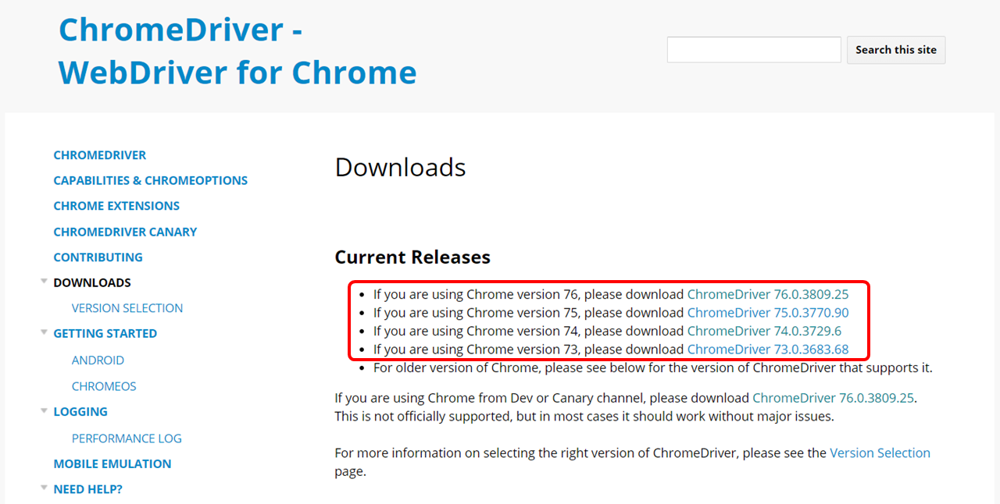
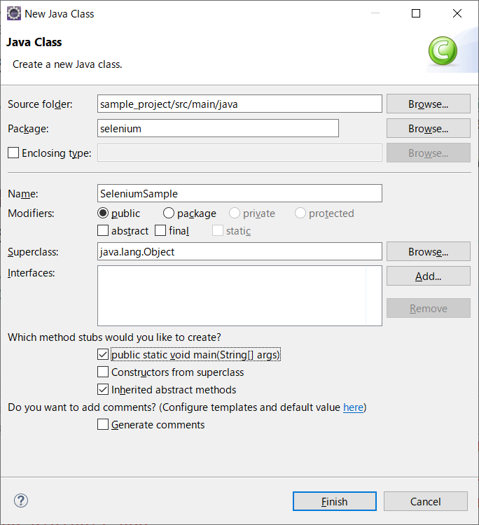
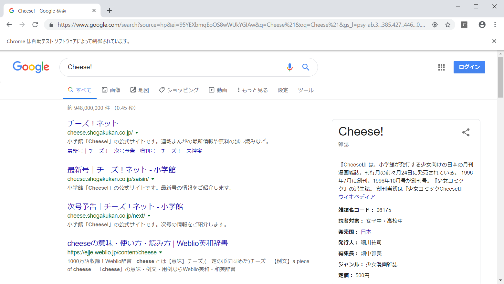
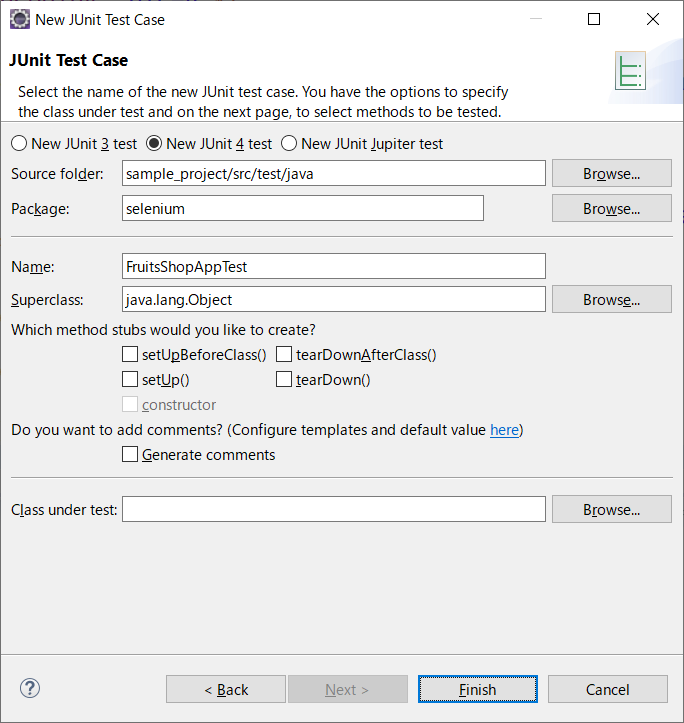
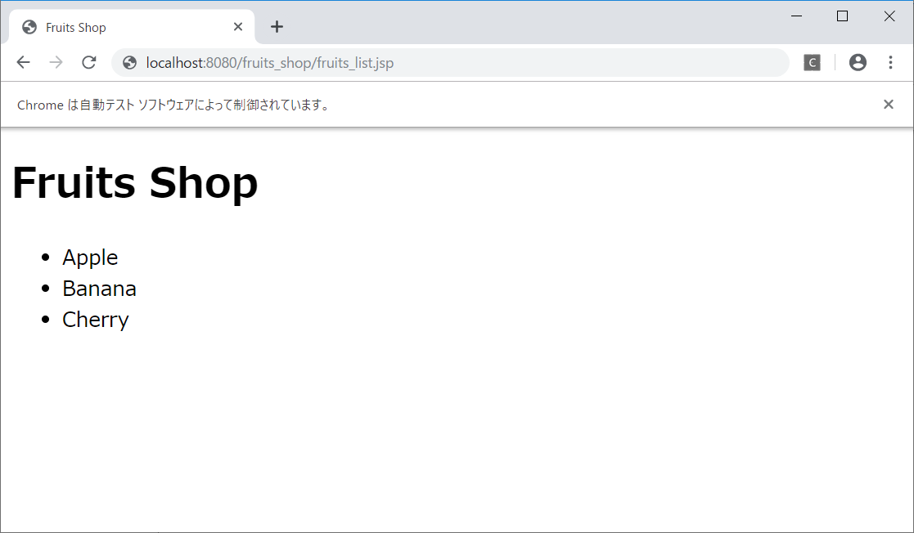
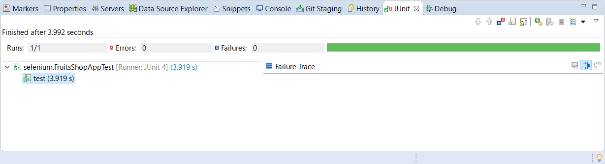
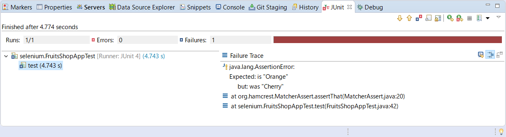

# 自動テストツール

## 4. Selenuim

Seleniumは、ブラウザのオペレーションを自動化するツールです。Selenium を利用することで、Web アプリケーションのテストを自動化することもできますし、テスト以外の分野、たとえばブラウザを使った管理作業の自動化なども実現できます。

### 4-1. WebDriverの活用

**Selenium WebDriver** はブラウザを操作する API を提供します。開発者はこれらの API を呼び出すことで、ブラウザ上に表示されたボタンをクリックしたり、データの表示を確認したりすることができます。<br>WebDriverを使用する際、ChromeやInternetExplorer、FireFoxといった各種ブラウザに合わせてドライバを実装する必要があります。

ここでは、Chrome上でオペレーションの自動化をしてみましょう。

Chromeを使う場合は、下記URLから別途ChromeDriverをダウンロードする必要があります。<br>https://sites.google.com/a/chromium.org/chromedriver/downloads



- 使用しているChromeのバージョンに合わせて、ダウンロードするChromeDriverを選択する
- ダウンロードしたChromeDriver（**chromedriver.exe**）をCドライブ直下に配置する

> Chromeのバージョンについては、Chrome右上のメニューボタン > [ヘルプ] > [Google Chrome について] で確認できます。

<br>



- Eclipse上でJavaクラスを作成する<br>
**Package**: selenium<br>
**Name**: SeleniumSample<br>
**publict static void main(String[] args)**: チェックON

<br>

- Google上で検索し、検索結果ページのタイトルを出力するプログラムを作成する（下記参照）

```java
package selenium;

import org.openqa.selenium.By;
import org.openqa.selenium.WebDriver;
import org.openqa.selenium.WebElement;
import org.openqa.selenium.chrome.ChromeDriver;
import org.openqa.selenium.support.ui.ExpectedCondition;
import org.openqa.selenium.support.ui.WebDriverWait;

public class SeleniumSample {

    public static void main(String[] args) {
        // GoogleDriverのパスを指定
        System.setProperty("webdriver.chrome.driver", "C:\\chromedriver.exe");

        // GoogleDriverインスタンスの生成
        WebDriver driver = new ChromeDriver();

        // Googleにアクセス
        driver.get("https://www.google.com");

        // Googleの検索ボックスを取得
        WebElement element = driver.findElement(By.name("q"));

        // 検索キーワードを入力
        element.sendKeys("Cheese!");

        // 送信ボタンをクリック
        element.submit();

        System.out.println("Page title is: " + driver.getTitle());

        // ページタイトルが表示されるまでWebDriverの処理を待つ
        (new WebDriverWait(driver, 10)).until(new ExpectedCondition<Boolean>() {
            public Boolean apply(WebDriver d) {
                return d.getTitle().toLowerCase().startsWith("cheese!");
            }
        });

        System.out.println("Page title is: " + driver.getTitle());

        // ブラウザの表示を終了
        driver.quit();
    }
}
```

<br>



- Seleniumプログラムを実行する

> 自動でChromeが起動し、検索結果が表示されます。

<br>

### 4-2. WebDriver実践

JUnit と Selenium WebDriverを組み合わせてテストプログラムを作成してみましょう。<br>以下のプログラムを作成します。

- fruits_list.jsp（テスト対象）
- FruitsShopAppTest.java

<br>

**フルーツ一覧（fruits_list.jsp）**

```html
<%@ page import="java.util.* "%>
<%@ page language="java" contentType="text/html; charset=UTF-8"
    pageEncoding="UTF-8"%>
<%
    String pageTitle = "Fruits Shop";
    List<String> fruitsList = Arrays.asList("Apple", "Banana", "Cherry");
%>
<!DOCTYPE html>
<html>
<head>
<meta http-equiv="Content-Type" content="text/html; charset=UTF-8">
<title><%= pageTitle %></title>
</head>
<body>
    <h1><%= pageTitle %></h1>
    <ul>
        <%
            for (String fruits : fruitsList) {
        %>
        <li><%= fruits %></li>
        <%
            }
        %>
    </ul>
</body>
</html>
```

<br>



- JUnitテストケースを作成する<br>
**Package**: selenium<br>
**Name**: FruitsShopAppTest<br>

<br>

- フルーツ一覧（fruits_list.jsp）をテストするプログラムを作成する（下記参照）

```java
package selenium;

import static org.hamcrest.CoreMatchers.is;
import static org.junit.Assert.assertThat;

import java.util.List;

import org.junit.Test;
import org.openqa.selenium.By;
import org.openqa.selenium.WebDriver;
import org.openqa.selenium.WebElement;
import org.openqa.selenium.chrome.ChromeDriver;

public class FruitsShopAppTest {

    @Test
    public void test() {
        // GoogleDriverのパスを指定
        System.setProperty("webdriver.chrome.driver", "C:\\chromedriver.exe");

        // GoogleDriverインスタンスの生成
        WebDriver driver = new ChromeDriver();

        // fruits_shop.jspにアクセスする
        driver.get("http://localhost:8080/fruits_shop/fruits_list.jsp");

        String expectPageTitle = "Fruits Shop";
        String pageTitle = driver.getTitle();

        // ページタイトルを検証する
        assertThat(pageTitle, is(expectPageTitle));

        // h1要素を取得し、値を検証する
        WebElement h1 = driver.findElement(By.tagName("h1"));
        assertThat(h1.getText(), is(expectPageTitle));

        // li要素を取得し、要素数と各値を検証する
        List<WebElement> liList = driver.findElements(By.tagName("li"));
        assertThat(liList.size(), is(3));
        assertThat(liList.get(0).getText(), is("Apple"));
        assertThat(liList.get(1).getText(), is("Banana"));
        assertThat(liList.get(2).getText(), is("Cherry"));

        // ブラウザの表示を終了
        driver.quit();
    }
}
```

<br>

- Eclipseの実行ボタン > [Run As] > [JUnit Test] でプログラムを実行する

<br>



> 自動でChromeが起動し、フルーツ一覧が表示されます。

<br>

- 画面表示が期待値どおりの場合：



- 画面表示が期待値どおりでない場合：



<br><br>

<a href="../README.md">>> メニューへ</a>
