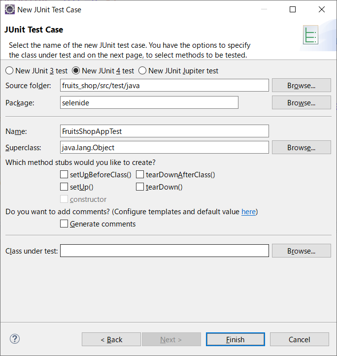
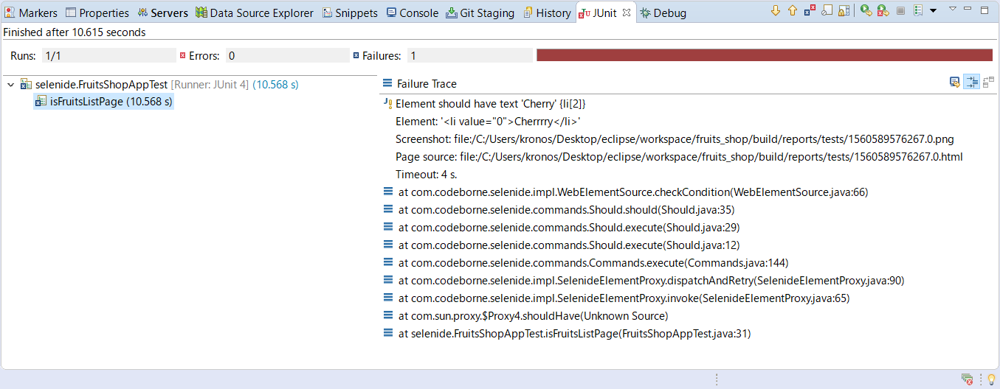
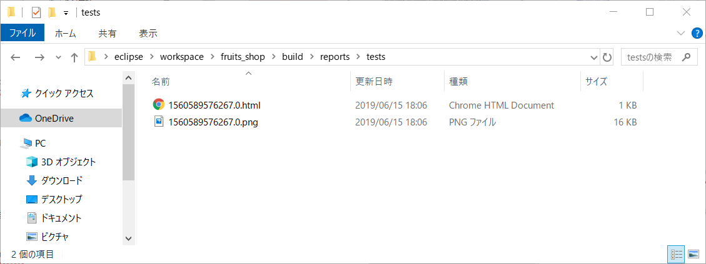

# 自動テストツール

## 5. Selenide

前項のSeleniumは、Webブラウザの操作を自動化するためのツールですが、自動テストに特化したツールではありません。そのため、Seleniumを使ったテストコードには、冗長になってしまう部分があります。

そこでSeleniumの弱点を補うブラウザテストとして登場したのが「**Selenide**」です。Selenideはブラウザを使った自動テストに特化したツールで、Seleniumでは冗長な記述となってしまう部分も簡潔にテストコードが書けるようになっています。

その他、下記のような特徴が挙げられます。

- **要素取得・チェックなど高水準 API の提供**<br>
Selenium でブラウザテストを行う場合、別途テストライブラリとして JUnit の Assertion クラスなどを併用する必要があります。一方の Selenide はブラウザテストをサポートしているため Selenide だけで自動テストを完了することができます。また Selenide のライブラリを使うことで、HTML 要素を取得する際に、jQuery のように$メソッドを使って要素を取得することができます。

- **Ajaxサポート**<br>
ブラウザテストでは Ajax(非同期通信)で実装されたページもテストしなければなりません。Selenium では Ajax の処理が完了するまで待機処理を明示的に実装しなくてはなりません。一方 Selenide ではライブラリ内の待機処理が実装されています。<br>※待機処理のデフォルトのタイムアウトは 4 秒です。

- **テスト失敗時の自動スクリーンショット**<br>
Selenide はテストに失敗した場合、失敗の原因をログに出力することができます。またその際のブラウザのスクリーンショットも自動で取得できます。テスト後にスクリーンショットを確認することでテストの失敗を分析することができます。

<br>

### 5-1. Selenide実践

前項でSelenuimを使って作成したフルーツ一覧のテストコードを、Selenideで作成して実行してみましょう。

<br>



- JUnitテストケースを作成する

<br>

- フルーツ一覧（fruits_list.jsp）をテストするプログラムを作成する（下記参照）

```java
package selenide;

import org.junit.Test;

import com.codeborne.selenide.Condition;
import com.codeborne.selenide.Configuration;
import com.codeborne.selenide.ElementsCollection;
import com.codeborne.selenide.Selenide;
import com.codeborne.selenide.WebDriverRunner;

public class FruitsShopAppTest {

    @Test
    public void isFruitsListPage() {

        // WebDriverの設定
        Configuration.browser = WebDriverRunner.CHROME;
        System.setProperty("webdriver.chrome.driver", "C:\\chromedriver.exe");

        // フルーツ一覧（fruits_list.jsp）にアクセスする
        Selenide.open("http://localhost:8081/fruits_shop/fruits_list.jsp");

        // h1要素を検証する
        Selenide.$("h1").shouldHave(Condition.exactText("Fruits Shop"));

        // li要素を検証する
        ElementsCollection lists = Selenide.$$("li");
        lists.shouldHaveSize(3);
        lists.get(0).shouldHave(Condition.text("Apple"));
        lists.get(1).shouldHave(Condition.text("Banana"));
        lists.get(2).shouldHave(Condition.text("Cherry"));
    }
}
```

<br>

- JUnitテストを実行する

> Selenium実行時と同様に、自動でChromeが起動し、フルーツ一覧が表示されます。また、JUnitタブに実行結果が表示されます。

<br>

### 5-2. テスト異常時の結果を確認する

Selenideは、テストの実行結果が期待と異なる場合、テスト対象画面のスクリーンショットを自動で出力してくれます。

テストの実行結果が期待と異なると、EclipseのJUnitタブに以下のようなエラー情報を表示されます。



エラー情報の中には、スクリーンショットの出力先も表示されます。<br>エクスプローラーで出力先を確認するとHTMLファイルとPNGファイルが作成されています。



<br><br>

<a href="../README.md">>> メニューへ</a>
