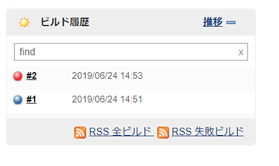

# 自動テストツール

## 6. CIとJenkins

**CI（Continuous Integration）** とは**継続的インテグレーション**という意味であり、コードリポジトリへのコミット時に自動テストを実行したり、スケジューラによって定期的にビルドを繰り返したりすることを意味します。 もう少し具体的に言うと、CI ツールを使うことで、Git や Subversion にソースコードをコミット時に Maven によってソースコードをビルドし、ビルドしたソースコードは JUnit や DbUnit によってテストするという一連の作業を自動化できます。これにより、ビルドやテストといった作業の手間が省けるとともに、バグの早期発見が可能となり、品質の向上にもつながります。

  

### 6-1. CI に必要な要素

効果的な CI を実現するには、以下の内容を満たすことが必要とされています。

1. ソースコード管理
    - バージョン管理ソフト（SVN や Git など）を使ってすべてのソースコードを管理し、誰でも最新の（時に
は過去の）ソースを取り出すことが可能な、１つの出入口を設定すること
    - 誰の変更で壊れたのかがわかるように履歴を残すこと

2. 自動ビルド
    - 手動によるビルドは時間の無駄やミスの温床であるため、ビルドプロセスを make ツール（Ant）やプロ
ジェクト管理ツール（Maven）などを使って自動化していること
    - 開発者のローカルでは発生しないエラーを検知するために、統合マシン上で最新のソースからビルド
すること

3. 自動テスト
    - より迅速率的にバグを検出するために、テスト作業をテスト自動化ツール（JUnit や DbUnit など）によ
って、自動化していること
    - ユニットテストだけでなく、部品を組み合わせた結合（統合）テストも自動化していること

4. シームレスな統合
    - 複数の開発者間の競合を素早く見つけるために、頻繁なコミットに対応していること
    - 統合の結果が誰でも見られること
    - 何が起こっているかを素早くフィードバックし、バグがあった際にすぐに修正に取り掛かれること

CI とは前述の要素を満たし、「すべてが自動化された」「再現可能なビルドを」「1 日に何度も実行」する活動のことをいいます。

 

### 6-2. Jenkinsの概要

**Jenkins** は Servlet をベースに動作する Web アプリケーション型の CI ツールです。これまでに紹介した JUnit、Git、Maven などを統合的に使用し、プロジェクトを円滑に進めることができます。 Jenkins はもともと日本人の川口耕介氏が開発したツールで、以前は Hudson という名前で世間に認知されていました。しかし、Oracle 社が 2010 年 12 月に Hudson を商標登録したため、Hudson からフォークし Jenkins と名
前を変え、現在もオープンソースの CI ツールとして使われています。

URL: https://jenkins.io/

 

### 6-3. Jenkinsの実践

ここでは Jenkins を活用して、ソースコードの管理（取得）、ビルドの実行、自動テストまでの一連の流れを自動化してみます。

バージョン管理ツール：Git ビルドツール：Maven 自動テストツール：JUnit、DbUnit、Selenideなど

- メニューから[新規ジョブ作成]をクリックする

 

- ジョブ名を入力し、[フリースタイル・プロジェクトのビルド]を選択する
- [OK]ボタンをクリックする

 

- ソースコード管理を設定する オプション： Git リポジトリURL： リモートリポジトリのURL 認証情報： リモートリポジトリへのアクセス情報

> 認証情報は、[追加]ボタン > [Jenkins] から追加ができます。 

 

- ビルド・トリガを設定する オプション： SCMをポーリング スケジュール： H/2 * * * *

> **SCM（Software Configuration Management）** は日本語でソフトウェア構成管理を表し、ここではGitやSubversionなどのバージョン管理を指します。 **ポーリング**とは定期的に問い合わせを行う通信方式で、ここでは Git や Subversion に対してどのくらいの周期（間隔）で問い合わせを行うのかをスケジュール欄に指定します。 **スケジュール**は、半角スペース区切りの「分 時 日 月 曜日」でポーリングの間隔を指定します。 下記の記載例を参考にしてください。  H/2 * * * *　⇒　2分おきに実行 H 12 * * *　⇒　毎日12時に実行 H 0,12,18 * * *　⇒　毎日0時、12時、18時に実行 H 19 * * 1-5　⇒　平日19時に実行　※曜日は 0（日曜日）始まり

 

- ビルドの設定をする ビルド手順の追加： Mavenの呼び出し

 

- ビルドの設定をする 使用するMaven： デフォルト ゴール： clean test
- [保存]ボタンをクリックする

 

  

以上で Jenkins の設定が完了です。 設定したGitリポジトリに対してソースコードをプッシュすると、Jenkinsが自動で動作し、一連の処理を実行します。

> Gitにプッシュして一時待つと、左下のビルド履歴の表示が切り替わります。

> ソースコードの取得～テスト実行までの一連の処理を実行します。

> 処理結果により丸いアイコンの色が変わります。 青色：ビルドもテストも成功 黄色：ビルドは成功したが、テストは失敗 赤色：ビルド失敗 灰色：ビルド中

 

> ビルド履歴の丸いアイコンをクリックすると、実行結果のログが確認できます。

 

<a href="../README.md">>> メニューへ</a>
